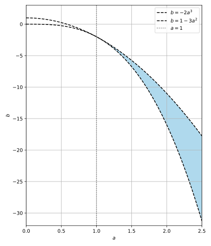

# [こばのページ](../../index.html)/[東大入試数学過去問解答例](../index)/2018 年度理科 第 4 問

## 問題

$a>0$とし，

$$f(x)=x^3-3a^2x$$

とおく。次の2条件をみたす点$(a, \, b)$の動きうる範囲を求め，座標平面上に図示せよ。\\
条件１：方程式$f(x)=b$は相異なる3実数解をもつ。\\
条件２：さらに，方程式$f(x)=b$の解を
$\alpha<\beta<\gamma$とすると$\beta>1$である。

## 解答

> $f$ は3次の係数が正なので、 `/\/` という形になるはず。

$f'(x) = 3x^2-3a^2$ であるから、 $f'(x) = 0 \Leftrightarrow x = a \lor x =-a$ が成り立つ。

方程式が相異なる3実数解をもつ条件は

$$f(a)<b<f(-a)$$

であり，このとき $-a<\beta<a$ である。

ただし，$\beta$ は $-a<\beta<a$ を満たすので，$\beta>1$ となるためには $a>1$ が必要である。

$a>1$ のとき，$1$ は $(-a,a)$ に含まれ，この区間で $f$ は単調減少する。したがって，

$$\beta>1 \Longleftrightarrow f(\beta)<f(1) \Longleftrightarrow b<f(1)$$

である。

ここで

$$f(a)=-2a^3, \qquad f(1)=1-3a^2$$

だから，求める範囲は

$$a>1 \land -2a^3<b<1-3a^2$$

である。

したがって，$a>1$ の部分で，曲線 $b=-2a^3$ の上側かつ曲線 $b=1-3a^2$ の下側の領域である。両曲線および直線 $a=1$ は含まれない。

