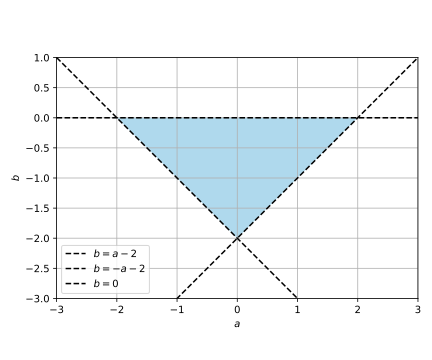
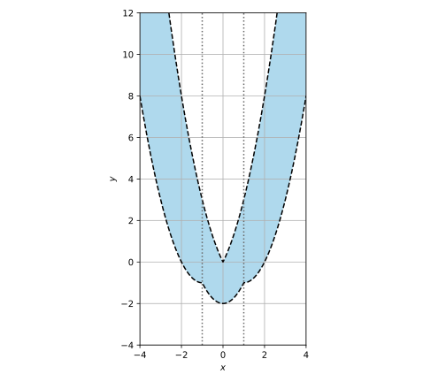

# [こばのページ](../../index.html)/[東大入試数学過去問解答例](../index)/2021 年度理科 第 1 問

## 問題

$a,b$ を実数とする。座標平面上の放物線

$$C: y = x^2 + ax + b$$

は放物線 $y = -x^2$ と2つの共有点を持ち、一方の共有点の $x$ 座標は $-1<x<0$ を満たし、他方の共有点の $x$ 座標は $0<x<1$ を満たす。

(1) 点 $(a,b)$ のとりうる範囲を座標平面上に図示せよ。

(2) 放物線 $C$ の通りうる範囲を座標平面上に図示せよ。

## 解答

### (1)

> 典型的な存在範囲の問題。 $f(x)=0$ の形に変形すれば $f$ は二次関数だから、 $f$ の 2次の項が正になるようにすれば $f(-1) > 0, f(0) < 0, f(1) > 0$ でいいだろ。

$x^2 + ax + b = -x^2$ が $-1<x<0$ と $0<x<1$ の範囲に 1 個ずつ解を持つような $(a,b)$ の条件を求めれば良い。
式変形すると $2x^2 + ax + b = 0$ だから、 $f(x) := 2x^2 + ax + b$ とすれば問題の条件は $f(-1) > 0, f(0) < 0, f(1) > 0$ と同値。

- $f(-1) > 0, f(0) < 0$ から、中間値の定理より開区間 $(-1,0)$ の範囲に $f(x) = 0$ なる $x$ が 1 個以上存在する。$f(0) < 0, f(1) > 0$ から、開区間 $(0,1)$ の範囲にも 1 個以上存在する。 $f(x)$ は 2 次式なので、$f(x)=0$ なる $x$ は高々2個であり、よって両方の開区間にちょうど1個ある。
- 逆に、$(-1,0)$ と $(0,1)$ の範囲にそれぞれ 1 個の $f(x)=0$ の解があるのであれば、$f(-1) > 0, f(0) < 0, f(1) > 0$ は明らか。

$f(-1) = -a+b+2 > 0, f(0) = b < 0, f(1) = a+b+2 > 0$ を全て満たす範囲を求めればよい。求める範囲は以下の図の通りである。境界は含まない。

### (2)

> $\exists a\ldotp \exists b \ldotp -a+b+2 > 0 \wedge b < 0 \wedge a+b+2 > 0 \wedge y = x^2 + ax + b$ を量化子消去したい。
>
> 図の形を見ると、$b$ を基準にして見れば $-2 < b < 0 \wedge -b-2 < a < b+2$ というわかりやすい条件式になることがわかる。
>
> $y = x^2 + ax + b$ は $a$ の一次式なので比較的扱いは簡単だが、 $x$ の符号によって多少扱いが変わり面倒である。最初から $x$ で場合分けした方が、論理式で場合分けするよりは楽だろう。

$\exists a\ldotp \exists b \ldotp -a+b+2 > 0 \wedge b < 0 \wedge a+b+2 > 0 \wedge y = x^2 + ax + b$ と同値な論理式を導出する方針を採る。

この論理式は $P: \exists b\ldotp -2 < b < 0 \wedge (\exists a \ldotp -b-2 < a < b+2 \wedge y = x^2 + ax + b)$ と同値である。

$x$ の符号によって場合分けする。

#### (i) $x=0$ のとき
$P$ は $\exists b\ldotp -2 < b < 0 \wedge (\exists a \ldotp -b-2 < a < b+2 \wedge y = b)$ である。 $\exists a \ldotp -b-2 < a < b+2$ が $-2 < b < 0$ の時恒真命題であることに注意すると、$P$ は明らかに $-2 < y < 0$ と同値である。

#### (ii) $x > 0$ のとき

$y=x^2+ax+b$ は $a$ の係数が正である一次式であるため、 $\exists a \ldotp -b-2 < a < b+2 \wedge y = x^2 + ax + b$ は $x^2 -(b+2)x+b < y < x^2 + (b+2)x + b$ と同値である。$(-x+1)b + x^2-2x < y < (x+1)b + x^2+2x$ と変形すると、左・真ん中・右はどれも $b$ の一次式である。

##### (ii-i) $0 < x \le 1$ のとき
このときは $x^2-2 < y < x^2+2x$ と同値である。

- TODO

> 下の傾きが正で上の傾きが正なのであれば、右上に伸びた台形みたいな形になるので、上側は $b=0$ のときの値が、下側は $b=-2$ のときの値が、それぞれリミットになるだろう。

##### (ii-ii) $x > 1$ のとき
このときは $x^2-2x < y < x^2+2x$ と同値である。

以上をまとめると、 $P$ は $(0 < x \le 1 \wedge x^2-2 < y < x^2+2x) \vee (x \ge 1 \wedge x^2-2x < y < x^2+2x)$ と同値である。

- TODO

> 下の傾きが負で上の傾きが正なのであれば、右側が大きい台形みたいな形になるので、$b=0$ のときの値がリミットになるだろう。

#### (iii) $x < 0$ のとき

> $a$ の条件は $-1$ 倍しても変わらないし、 $x$ を $-x$ にして変わるのは $x$ の係数の $a$ 部分だけだ。 (ii) の結果を流用しよう。

$z := -x$ とおく。 $y = x^2 + ax + b$ は $y = z^2 - az + b$ と同値であるし、 $-b-2 < a < b+2$ と $-b-2 < -a < b+2$ が同値であることに注意すると、$P$ は $\exists b\ldotp -2 < b < 0 \wedge (\exists a \ldotp -b-2 < a < b+2 \wedge y = z^2 + az + b)$ と同値である。よって (ii) の結果を流用することができ、 $P$ は $(-1 \le x < 0 \wedge x^2-2 < y < x^2-2x) \vee (x \le -1 \wedge x^2+2x < y < x^2-2x)$ と同値である。

以上をまとめて簡潔な式で表すと、$P$ は $(0 \le \|x\| \le 1 \wedge x^2-2 < y < x^2+2\|x\|) \vee (\|x\| \ge 1 \wedge x^2-2\|x\| < y < x^2+2\|x\|)$ と同値である。

求める範囲は以下の図の通りである。境界は含まない。

