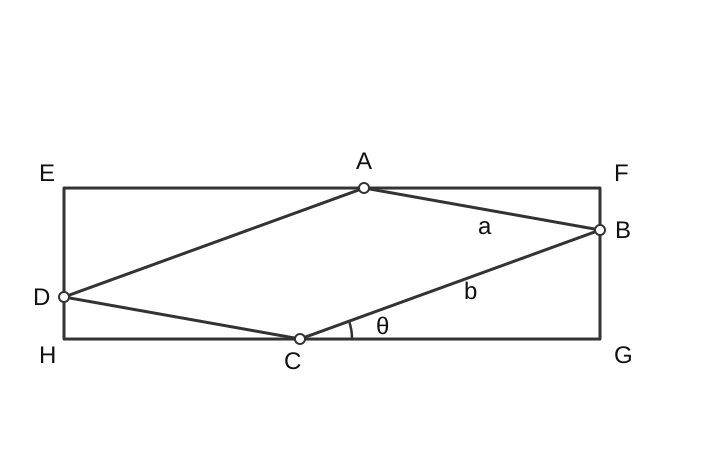

# [こばのページ](../../index.html)/[東大入試数学過去問解答例](../index)/2025 年度理科 第 3 問

## 問題

平行四辺形 $\mathrm{ABCD}$ において，$\angle \mathrm{ABC}=\dfrac{\pi}{6}, \mathrm{AB}=a, \mathrm{BC}=b, a \le b$ とする。次の条件を満たす長方形 $\mathrm{EFGH}$ を考え，その面積を $S$ とする。

条件：　点 $\mathrm{A}, \mathrm{B}, \mathrm{C}, \mathrm{D}$ はそれぞれ辺 $\mathrm{EF}, \mathrm{FG}, \mathrm{GH}, \mathrm{HE}$ 上にある。

ただし，辺はその両端の点も含むものとする。

(1) $\angle \mathrm{BCG}=\theta$ とするとき，$S$ を $a, b, \theta$ を用いて表せ。

(2) $S$ のとりうる値の最大値を $a, b$ を用いて表せ。

## 解答

### (1)

> 図を描くと以下のようになる。
>
> 
>
> $\mathrm{C}$ を原点として、$\mathrm{C}\mathrm{G}$ をx軸の正の方向とすれば、$\mathrm{B}$ や $\mathrm{A}$ の座標は三角関数の合成や回転操作などで簡単に計算できる。そこから $S$ も計算できる。

点 $\mathrm{C}$ を原点として、$\mathrm{C}\mathrm{G}$ をx軸の正の方向としよう。点 $\mathrm{B}$ の座標は$(b\cos \theta, b\sin \theta)$ であり、ベクトル $\overrightarrow{\mathrm{BA}} = \overrightarrow{\mathrm{CD}}$ は

$$
\overrightarrow{\mathrm{BA}} = \overrightarrow{\mathrm{CD}} = \left(-a\cos\left(\frac{\pi}{6}-\theta\right),\ a\sin\left(\frac{\pi}{6}-\theta\right)\right)
$$

である。よって、

$$
\mathrm{HG}=b\cos\theta+a\cos\left(\frac{\pi}{6}-\theta\right), \quad
\mathrm{GF}=b\sin\theta+a\sin\left(\frac{\pi}{6}-\theta\right)
$$

であり、

$$
S=\mathrm{HG}\cdot \mathrm{GF} = \left\{b\cos\theta+a\cos\left(\frac{\pi}{6}-\theta\right)\right\}\left\{b\sin\theta+a\sin\left(\frac{\pi}{6}-\theta\right)\right\}
$$

である。

### (2)
> $\theta$ は $0 \le \theta \le \dfrac{\pi}{6}$ の範囲を動く。$S$を展開して $\sin,\cos$の式にしたら簡単になりそう。

$\theta$ は $0 \le \theta \le \dfrac{\pi}{6}$ の範囲を動く。

$\mathrm{HG}$ と $\mathrm{GF}$ を $\sin\theta, \cos\theta$ で表すと

$$
\mathrm{HG}=\left(b+\frac{\sqrt{3}}{2}a\right)\cos\theta+\frac{a}{2}\sin\theta
$$

$$
\mathrm{GF}=\left(b-\frac{\sqrt{3}}{2}a\right)\sin\theta+\frac{a}{2}\cos\theta
$$

である。よって、

$$
\begin{align*}
S&=\left\{\left(b+\frac{\sqrt{3}}{2}a\right)\cos\theta+\frac{a}{2}\sin\theta\right\}
\left\{\left(b-\frac{\sqrt{3}}{2}a\right)\sin\theta+\frac{a}{2}\cos\theta\right\}\\
&=\left(b^2-\frac{a^2}{2}\right)\sin\theta\cos\theta
+\frac{a}{2}\left(b+\frac{\sqrt{3}}{2}a\right)\cos^2\theta
+\frac{a}{2}\left(b-\frac{\sqrt{3}}{2}a\right)\sin^2\theta\\
&=\left(b^2-\frac{a^2}{2}\right)\sin\theta\cos\theta+\frac{ab}{2}
+\frac{\sqrt{3}a^2}{4}\left(\cos^2\theta-\sin^2\theta\right)
\end{align*}
$$

である。したがって、

$$
S=\frac{1}{2}\left(b^2-\frac{a^2}{2}\right)\sin 2\theta+\frac{ab}{2}
+\frac{\sqrt{3}a^2}{4}\cos 2\theta
$$

である。

> ここまできたらあとは三角関数の合成をするだけだ。
> $b\ge a$ に注意すると、
>
> $$
> \frac{1}{2}\left(b^2-\frac{a^2}{2}\right) \ge \frac{a^2}{4}
> $$
>
> だから、$\sin(2\theta+\alpha)$ という形にするなら $0<\alpha\le \dfrac{\pi}{3}$ だろう。
> $2\theta$ の動く範囲は $\left[0,\dfrac{\pi}{3}\right]$ だろうから、$2\theta+\alpha$が$\dfrac{\pi}{2}$になり得るかどうかはギャンブルだ。
> 場合分けが必要。

$x=2\theta$ とおくと、$0 \le x \le \dfrac{\pi}{3}$ であり、

$$
S=\frac{ab}{2}+\left(\frac{b^2}{2}-\frac{a^2}{4}\right)\sin x+\frac{\sqrt{3}a^2}{4}\cos x
$$

である。ここで、

$$
A=\frac{b^2}{2}-\frac{a^2}{4},\quad B=\frac{\sqrt{3}a^2}{4}
$$

とおく。$b\ge a$ なので $A>0,\ B>0$ である。$A\sin x+B\cos x=R\sin(x+\alpha)$ と書くと、

$$
R=\sqrt{A^2+B^2},\quad \cos\alpha=\frac{A}{R},\quad \sin\alpha=\frac{B}{R}
$$

であり、$0<\alpha\le \dfrac{\pi}{3}$ である。

$x+\alpha$ が $\dfrac{\pi}{2}$ をとりうる条件は

$$
\alpha\le \frac{\pi}{2}\le \alpha+\frac{\pi}{3}
$$

すなわち $\alpha\ge \dfrac{\pi}{6}$ である。$0<\alpha<\dfrac{\pi}{2}$ であるから、これは

$$
B\ge \frac{A}{\sqrt{3}}
$$

と同値であり、整理すると $b\le \sqrt{2}a$ である。

よって、$a\le b\le \sqrt{2}a$ のとき、$S$ の最大値は

$$
\frac{ab}{2}+R
=\frac{ab}{2}+\sqrt{\left(\frac{b^2}{2}-\frac{a^2}{4}\right)^2+\frac{3a^4}{16}}
=\frac{ab}{2}+\frac{1}{2}\sqrt{b^4-a^2b^2+a^4}
$$

である。

一方、$b\ge \sqrt{2}a$ のときは $S$ は $x=\dfrac{\pi}{3}$ で最大となるので、$S$ の最大値は

$$
\frac{ab}{2}+\frac{\sqrt{3}b^2}{4}
$$

である。

以上より、求める最大値は

$$
\left\{
\begin{array}{ll}
\dfrac{ab}{2}+\dfrac{1}{2}\sqrt{b^4-a^2b^2+a^4} & \left(a\le b\le \sqrt{2}a\right),\\[6pt]
\dfrac{ab}{2}+\dfrac{\sqrt{3}b^2}{4} & \left(b\ge \sqrt{2}a\right)
\end{array}
\right.
$$

である。
